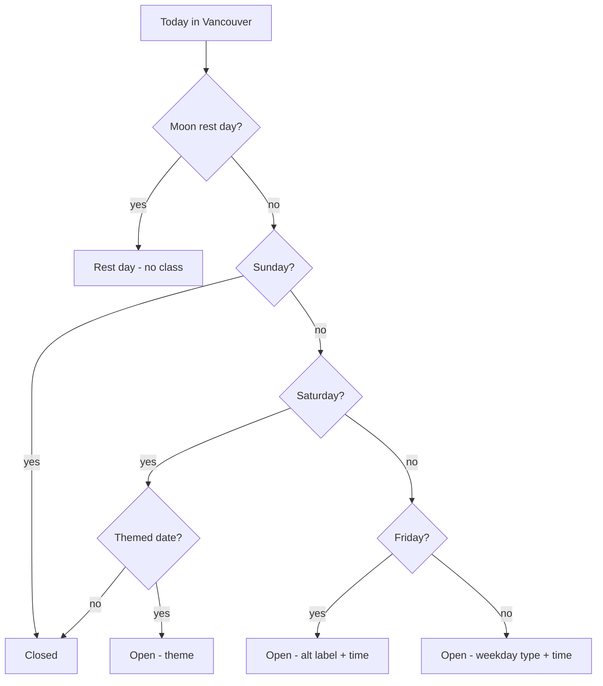

## Goal
A calm, single-page marketing site for a new Ashtanga yoga shala in Vancouver, BC. Content lives in one owner-editable YAML file. Minimal navigation. Includes a dynamic, always-current "Today at the shala" banner driven entirely by owner-editable inputs.

## Tech stack
- **Astro** (static output) + **Tailwind CSS**
- All editable content in a single **`src/content/site.yaml`** (heavily commented), parsed at build via `js-yaml`
- Schedule/moon-day logic in pure TypeScript functions
- **Netlify** deploy (auto-build from GitHub on every commit)
- No backend, no payment code (Square placeholder only)

## Design
Warm/earthy palette (sand, sage/clay accents, charcoal text), serif display headings (Google font e.g. Fraunces/Cormorant) + clean sans body (Inter), generous whitespace, large photos. Placeholder images in `public/images/` that the owner swaps by replacing files with the same names. Aesthetic modeled on First Light / AYV references.

## Page structure (single scroll, sticky header)
Nav anchors: **Practice · Schedule · Teacher · Rates · Visit**
1. **Hero** - shala name, tagline, "Vancouver, BC", CTA button
2. **The Practice** - short intro to Ashtanga Mysore self-practice (original wording)
3. **Schedule** - dynamic "Today" banner + weekly table + alternating-Friday note + Saturday-themes note + Full/New-Moon rest-day note
4. **Teacher** - photo placeholder + bio placeholder ("fill in later")
5. **Rates** - Drop-in $25, One month unlimited $180/month
6. **Consent & Safety** - consent-card culture, ask-before-assist, body autonomy (original wording inspired by First Light's principles)
7. **Payment** - placeholder: "Online payment (Square) coming soon; pay in studio / contact for now"
8. **Visit** - address `156 E 7th Ave, Vancouver, BC V5T 1M5`, embedded Google map, contact placeholders
9. **Footer**

## Schedule model (owner edits only these YAML inputs)
```yaml
schedule:
  monday:    { time: "6:00-8:15am",  type: "Open practice (no teacher guidance)" }
  tuesday:   { time: "5:45-8:15am",  type: "Teacher-supported independent practice" }
  wednesday: { time: "5:45-8:15am",  type: "Open practice (no guidance)" }
  thursday:  { time: "5:45-8:15am",  type: "Open practice (no teacher guidance)" }
  friday:    { time: "6:00-8:15am" }   # type alternates, see below
friday_alternates: ["Guided Practice", "Asana Skill Development"]
friday_anchor: { date: "2026-07-03", label: "Guided Practice" }  # a known Friday
saturday_themes:
  - { date: "2026-07-11", theme: "Bhagavad Gita focused practice" }
moon_rest_days: ["2026-07-10", "2026-07-24"]   # pre-filled w/ accurate 2026 full+new moons
```
- **Friday** label auto-alternates by computing week parity from `friday_anchor`.
- **Saturdays** are explicit dated entries (no fragile parity math; owner just adds a line).
- **Moon rest days** are an editable dated list (I'll pre-fill accurate 2026 Vancouver full/new-moon dates + link to timeanddate.com in a comment for future updates).

The "Today" banner is a tiny vanilla-JS island that reads this data (embedded as JSON) and computes the current day in **America/Vancouver**, so it's always accurate without rebuilds. Logic:


A static fallback line renders if JS is disabled.

## Files to create
```
package.json, astro.config.mjs, tsconfig.json, netlify.toml, .gitignore, README.md
public/images/           # placeholder hero/teacher images + favicon
src/content/site.yaml    # THE single editable content file (commented)
src/lib/schedule.ts      # pure alternation + moon-day functions
src/lib/schedule.test.ts # unit tests for the schedule logic
src/styles/global.css    # Tailwind + theme tokens + fonts
src/layouts/Base.astro
src/pages/index.astro
src/components/{Header,Hero,Practice,Schedule,TodayBanner,Teacher,Rates,Consent,Payment,Visit,Footer}.astro
```
`README.md` includes a short **"How to edit your site (non-technical)"** section (edit `site.yaml` via GitHub, replace images by filename) + **deploy steps** (connect repo to Netlify, build `npm run build`, publish `dist`).

## Verification
- `npm run build` succeeds; `npm run dev` preview
- `astro check` (no TS errors)
- Unit tests pass (`schedule.test.ts` verifies Friday parity, Saturday theme lookup, moon rest detection)
- Manually confirm banner text across sample dates

## Notes
- All copy is placeholder/original (teacher bio, hero tagline) so you can fill in later.
- No payment integration now; Square hooks in later by swapping placeholder buttons for checkout links.
- Domain: deploy first to the free `*.netlify.app` URL; custom domain can be pointed later.
